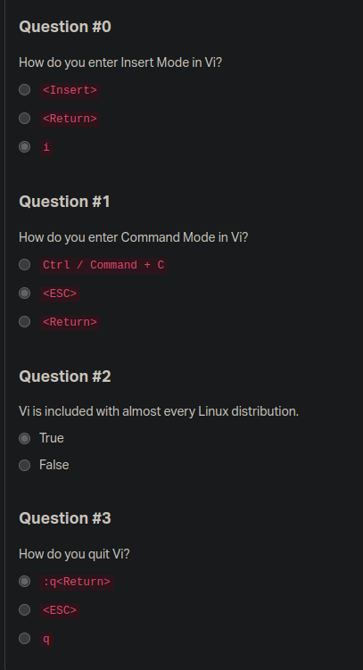

# My first readme - 0-Day - 0-Day

## 0x00. Shell, navigation

`cd /root`

Change your working directory to /root
Then, create an empty file so_cool

`touch so_cool`

Change your working directory to /root
Then, copy the file school to /tmp

`cp school /tmp`

Change your working directory to /root
Then, rename the file old_school to new_school (in the same directory)

`mv old_school new_school`

Change your working directory to /root
Then, move the file not_here to /tmp/right_school

`mv not_here /tmp/right_school`

Change your working directory to /root
Then, delete the file ready_to_be_removed

`rm ready_to_be_removed`

Change your working directory to /root
Then, create a directory school_is_amazing

`mkdir school_is_amazing`

Change your working directory to /root
Then, remove the directory empty_directory

`rmdir empty_directory`

all

```bash
  cd /root
  touch so_cool
  cp school /tmp
  mv old_school new_school
  mv not_here /tmp/right_school
  rm ready_to_be_removed
  mkdir school_is_amazing
  rmdir empty_directory
```

---

## 0x01. Emacs

Navigate to /root and create a directory named 0x01_emacs

`mkdir 0x01_emacs`

What is the command to open a file from within Emacs?
Write the answer into the file /root/0x01_emacs/opening.

`echo "C-x C-f" > /root/0x01_emacs/opening`

What is the command to save a file?
Write the answer into the file /root/0x01_emacs/saving.

`echo "C-x C-s" > /root/0x01_emacs/saving`

What is the command to cut an entire line?
Write the answer into the file /root/0x01_emacs/cutting.

`echo "C-k" > /root/0x01_emacs/cutting`

What is the command to paste?
Write the answer into the file /root/0x01_emacs/pasting.

`echo "C-y" > /root/0x01_emacs/pasting`

What is the command to search forward?
Write the answer into the file /root/0x01_emacs/searching.

`echo "C-s" > /root/0x01_emacs/searching`

What is the command to undo?
Write the answer into the file /root/0x01_emacs/undoing.

`echo "C-x u" > /root/0x01_emacs/undoing`

What is the command to quit Emacs?
Write the answer into the file /root/0x01_emacs/quitting.

`echo "C-x C-c" > /root/0x01_emacs/quitting`

all

```bash
  mkdir /root/0x01_emacs
  echo "C-x C-f" > /root/0x01_emacs/opening
  echo "C-x C-s" > /root/0x01_emacs/saving
  echo "C-k" > /root/0x01_emacs/cutting
  echo "C-y" > /root/0x01_emacs/pasting
  echo "C-s" > /root/0x01_emacs/searching
  echo "C-x u" > /root/0x01_emacs/undoing
  echo "C-x C-c" > /root/0x01_emacs/quitting
```

## 0x02. vi



Navigate to /root and create a directory named 0x02_vi

`mkdir 0x02_vi`

What is the command to insert text before the cursor?
Write the answer into the file /root/0x02_vi/inserting.

`echo "i" > /root/0x02_vi/inserting`

What is the command to delete and cut the current line?
Write the answer into the file /root/0x02_vi/cutting.

`echo "dd" > /root/0x02_vi/cutting`

What is the command to paste the lines in the buffer into the text after the current line?
Write the answer into the file /root/0x02_vi/pasting.

`echo "p" > /root/0x02_vi/pasting`

What is the command to undo what you just did?
Write the answer into the file /root/0x02_vi/undoing.

`echo "u" > /root/0x02_vi/undoing`

What is the command to quit vi even though latest changes have not been saved for this vi call?
Write the answer into the file /root/0x02_vi/exiting.

`echo ":q!" > /root/0x02_vi/exiting`

What is the command to move the cursor to the start of the current line?
Write the answer into the file /root/0x02_vi/beginning_of_the_line.

`echo "0" > /root/0x02_vi/beginning_of_the_line`

What is the command to move the cursor to the end of the line?
Write the answer into the file /root/0x02_vi/end_of_the_line.

`echo "$" > /root/0x02_vi/end_of_the_line`

all

```bash
  mkdir /root/0x02_vi
  echo "i" > /root/0x02_vi/inserting
  echo "dd" > /root/0x02_vi/cutting
  echo "p" > /root/0x02_vi/pasting
  echo "u" > /root/0x02_vi/undoing
  echo ":q!" > /root/0x02_vi/exiting
  echo "0" > /root/0x02_vi/beginning_of_the_line
  echo "$" > /root/0x02_vi/end_of_the_line
```
